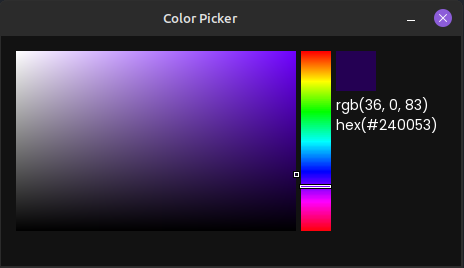

# ColorPicker (SFML)



# Dependencies (Ubuntu and other Debian-based distributions)

```bash
sudo apt update
sudo apt install \
 libxrandr-dev \
 libxcursor-dev \
 libudev-dev \
 libfreetype-dev \
 libopenal-dev \
 libflac-dev \
 libvorbis-dev \
 libgl1-mesa-dev \
 libegl1-mesa-dev
```

# Compile

For a single-configuration generator (typically the case on Linux and macOS):

```
cmake -S . -B build -DCMAKE_BUILD_TYPE=Release
cmake --build build
```

For a multi-configuration generator (typically the case on Windows):

```
cmake -S . -B build
cmake --build build --config Release
```

# Run

```bash
./build/bin/ColorPicker
```